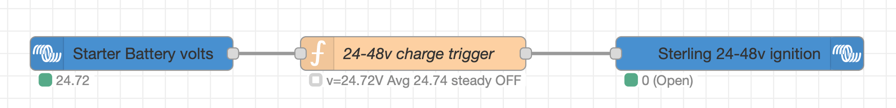
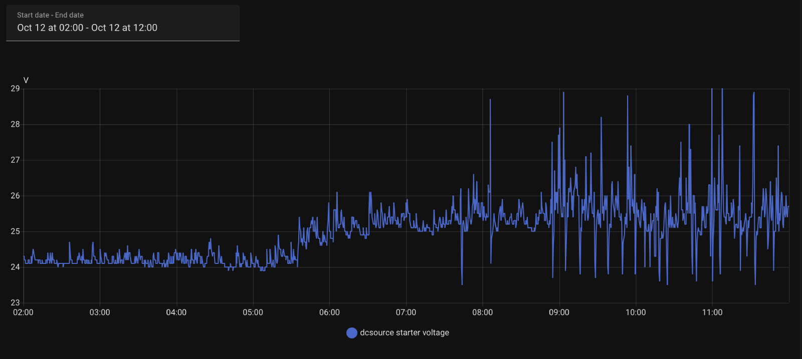

# Charge Control for Wind Turbine Buffer Battery

I have an off-grid energy setup that has solar and wind. Solar charges the 48v battery bank directly, but the wind turbine pushes power to a secondary 24v pack that runs the control logic of the turbine as well as buffers energy.

Most 24v -> 48v gear is for automotive or marine use where the assumption is that when you're charging from 24v the altenator is supplying power. But for a wind turbine that's not the case since it's very intermittent.

Using the standard voltage based control 24v buffer at its knees and only lasted seconds. I plan to switch from the AGM buffer bank to LTO chemistry that is fine with this. But for now I want to make sure I don't kill my buffer batteries.

## Node-RED on the Cerbo GX for reliable control

The 48v system is managed by a Victron Cerbo GX control. You can easily install a Node-RED environment on the device. With this it is possible to create some advanced logic.

With the help of a shunt reading both 48v (house) and 24v (aux) batteries and the internal relay connected to your DC DC charger's ignition it is possible to control charging with precision.

Note that the Turbine control logic is completely separate. I explicitly wanted to control based on the buffer voltage to keep it in condition.

This repository has a single JavaScript file that can be used as a custom function in Node-RED. It's placed between the aux shunt and relay to trigger charging based.

## Logic description

It works more or less like this:

- For steady conditions track voltage and trigger charging for a specified time once voltage is over a specific level. After a charge session let the battery rest for x minutes.
- In gusty situations where voltage can get out of and quick because the battery cannot take the power. This will normally be dumped as heat, but this script keeps track of voltage changes:
    - With rapid changes in voltage charging will be triggered and maintained above a specific level. To keep reasonable minimum charge times (no flickering) it also includes a tail timer.
- For specified under voltage situations the function will force a configurable resting period for the battery.

You can see the script running in different conditions in this voltage graph:

## Warranty and liability

I hold no responsibility for this software or anyone that. This is merely a public repository as a backup for myself and those interested in similar functionality.

